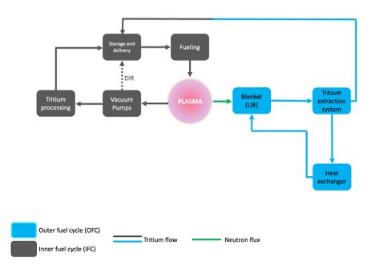
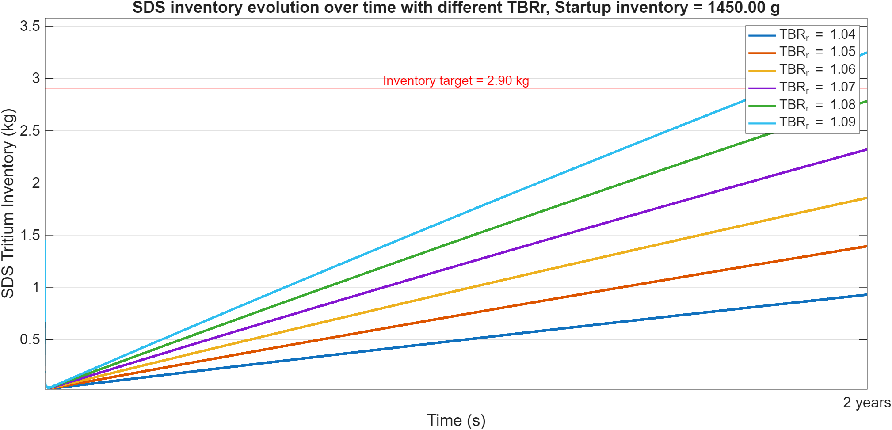
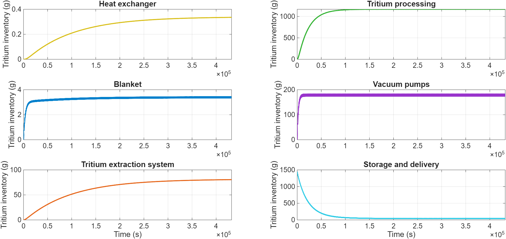

# Dynamics Modeling and Preliminary Design of a D-T Fusion Fuel Cycle

This repository contains the dynamic models, simulation routines, and data developed for the **Fuel Cycle, Waste and Decommissioning** course project as part of the Master's Degree in **Sustainable Nuclear Energy** at **Politecnico di Torino** (Academic Year 2025–2026).

* **Team members:** Francesca Margaria, Riccardo Grasso, Andrea Vair Piova
* **Course instructors:** Prof. Samuele Meschini, Prof. Raffaella Testoni

---

## Project overview
A closed tritium fuel cycle is an indispensable requirement for deuterium-tritium (D-T) fusion power plants (FPPs) to achieve fuel self-sufficiency, minimize radiological tritium inventories, and guarantee operational safety.

This project focuses on the preliminary engineering design and transient mass-balance modeling of the primary fuel cycle subsystems for a **$500\text{ MW}_{\text{th}}$ compact tokamak** operating with a 50-50 D-T fuel mixture.

### Key objectives
1. **Primary vacuum pumping sizing  and safety analysis:** size the divertor cryopump array, determine the regeneration residence time ($\tau_{CP}$), and evaluate safety compliance against the Lower Flammability Limit (LFL) under air-ingress accident conditions.
2. **Dynamic lumped-parameter modeling:** formulate and couple Ordinary Differential Equations (ODEs) representing the dynamic evolution of tritium inventory across all fuel cycle subsystems in MATLAB/Simulink.
3. **Self-sufficiency and breeding optimization:** determine the minimum startup tritium inventory ($I_{\text{startup}}$) and the required Tritium Breeding Ratio ($\text{TBR}_r$) to achieve a target inventory doubling time of $t_d = 2\text{ years}$ under pulsed operating conditions.

---

## Fuel cycle parameters and system architecture

The fuel cycle integrates both the Inner Fuel Cycle (IFC) and Outer Fuel Cycle (OFC):

<table align="center">
  <tr>
    <td align="center" width="50%" valign="top">
      
      <br>
      <em>Simplified fuel cycle layout of a compact tokamak fusion power plant [1].</em>
    </td>
  </tr>
</table>

### Reference operational parameters

| Parameter | Symbol | Value | Units |
| :--- | :--- | :--- | :--- |
| **Fusion thermal power** | $P_{\text{fus}}$ | $500$ | $\text{MW}_{\text{th}}$ |
| **Pulse duration / Dwell time** | $t_{\text{pulse}} / t_{\text{dwell}}$ | $15\text{ min} / 2\text{ min}$ | $-$ |
| **Tritium Burn Efficiency** | $\text{TBE}$ | $0.01$ (1%) | $-$ |
| **Direct Internal Recycling fraction** | $f_{\text{DIR}}$ | $0.30$ (30%) | $-$ |
| **Non-radioactive tritium loss fraction** | $\epsilon$ | $1 \times 10^{-4}$ | $-$ |
| **Divertor operational pressure** | $p_{\text{div}}$ | $1.0$ | $\text{Pa}$ |
| **Deuterium pumping speed (per pump)** | $S_D^{\text{real}}$ | $50$ | $\text{m}^3\text{s}^{-1}$ |
| **Breeding Blanket residence time** | $\tau_{\text{BB}}$ | $3600$ | $\text{s}$ |
| **Tritium Extraction System residence time**| $\tau_{\text{TES}}$ | $24$ | $\text{h}$ |
| **Heat Exchanger residence time** | $\tau_{\text{HX}}$ | $1$ | $\text{h}$ |
| **Isotope Processing residence time** | $\tau_P$ | $6$ | $\text{h}$ |
| **TES extraction efficiency** | $\eta_{\text{TES}}$ | $0.90$ (90%) | $-$ |

---

## Mathematical formulation

The dynamic evolution of tritium inventory $I_i$ in subsystem $i$ is modeled via lumped-parameter ODEs:

$$\frac{dI_i}{dt} = \sum_{j \neq i} \left( f_{j \to i} \frac{I_j}{\tau_j} \right) - (1 + \varepsilon_i)\frac{I_i}{\tau_i} - \lambda I_i + \dot{T}_i$$

where:
* $\tau_i$ is the characteristic residence time of component $i$.
* $f_{j \to i}$ is the split fraction routed from component $j$ to $i$.
* $\lambda = 1.78 \times 10^{-9}\text{ s}^{-1}$ is the tritium radioactive decay constant.
* $\varepsilon_i$ accounts for non-radioactive process leakages.
* $\dot{T}_i$ denotes direct sources/sinks (plasma fusion consumption and blanket breeding).

---

## Repository structure

```
dt-fusion-fuel-cycle-modeling/
├── images/
│   ├── sds_inventory_evolution_vs_TBR.png  # SDS inventory vs TBR_r (2-year span)
│   ├── simplified_fuel_cycle_scheme.JPG    # Fuel cycle block layout
│   └── steady_state_inventories.png        # Transients of all plant components
├── scripts_and_models/
│   ├── ass1_fuelcycle_cycle.m              # Iterative solver for I_startup & TBR_r
│   ├── ass1_steady_state.m                 # Steady-state inventories plot
│   └── sim_assignment_drive.slx            # Simulink lumped model
├── Grasso_Margaria_Vair Piova_ex_1.pdf     # Full assignment report
└── README.md
```

---

## Key results and discussion

### 1. Primary vacuum sizing and safety limit (LFL)
* **Pump sizing:** to handle the exhaust throughput from the divertor ($Q_{\text{tot}}$), a minimum of **$n_{\text{pumps}} = 3$ operational cryopumps** are required. Accounting for regeneration cycles, a total configuration of $6$ cryopumps (3 working, 3 regenerating in staggered cycles) ensures uninterrupted operation.
* **Residence time:** the nominal time to reach the sorbent saturation limit ($45\text{ mol}$ per pump) is $\tau_{\text{CP}} \approx 2315.3\text{ s}$ ($\sim 38.6\text{ min}$).
* **LFL safety constraint violation:** in a worst-case air ingress accident into the $10\text{ m}^3$ pump volume at $300\text{ K}$ and $1\text{ bar}$, total desorption of the $45\text{ mol}$ inventory results in a hydrogen concentration of **$11.22$%**, severely exceeding the Lower Flammability Limit of **$3$%**. Consequently, **regeneration must be scheduled well before saturation** to maintain safety margins.

### 2. Startup inventory and breeding self-sufficiency
Through iterative ODE dynamic simulations:
* **Minimum startup inventory:** $I_{\text{startup}} = 1.45\text{ kg}$ is strictly required to prevent total depletion of the Storage and Delivery System (SDS) during initial plant charging. The SDS inventory hits an absolute minimum inflection point of $34.98\text{ g}$ after approximately 3 days before rising.
* **Required TBR:** to achieve the target doubling time of $t_d = 2\text{ years}$ ($I_{\text{SDS}}(2\text{ y}) = 2.90\text{ kg}$), the plant requires:
  $$\mathbf{TBR_r = 1.09}$$
  Values of $\text{TBR}_r \le 1.08$ fail to reach the doubling target within 2 years.

<table align="center">
  <tr>
    <td align="center" width="50%" valign="top">
      
      <br>
      <em> SDS inventory (kg) for different TBRr over a 2 year period of time.</em>
    </td>
  </tr>
</table>

### 3. Component tritium inventories at steady-state

The system reaches dynamic equilibrium after $\approx 5\cdot\tau_{\text{TES}} = 5\text{ days}$ ($432{,}000\text{ s}$):

| Subsystem | Steady-state inventory [g] | Key driver / mechanism |
| :--- | :---: | :--- |
| **Tritium Processing Plant (P)** | **$1166.6$** | Largest holdup ($>80$% of active plant inventory) due to isotopic separation residence time ($\tau_P = 6\text{ h}$) |
| **Cryopumps (CP)** | **$179$** (oscillating $174 - 184$) | Cyclic sorption/desorption and periodic pump regeneration |
| **Tritium Extraction System (TES)** | **$80.5$** | Governed by $\tau_{\text{TES}} = 24\text{ h}$ and $\eta_{\text{TES}} = 0.90$ |
| **Storage and Delivery System (SDS)** | **$44.0$** | Buffer equilibrium before long-term accumulation |
| **Breeding Blanket (BB)** | **$3.4$** | Fast tritium extraction from the FLiBe molten salt carrier ($\tau_{\text{BB}} = 3600\text{ s}$) |
| **Heat Exchanger (HX)** | **$0.34$** | Intermediate loop transit holdup ($\tau_{\text{HX}} = 1\text{ h}$) |

<table align="center">
  <tr>
    <td align="center" width="50%" valign="top">
      
      <br>
      <em> Changes over time in the tritium inventories in each component until steady-state is reached.</em>
    </td>
  </tr>
</table>

---

## Getting started

### Prerequisites

* MATLAB & Simulink (R2022b or later recommended).

### Running the simulations

1. **Clone the repository:**

   ```bash
   git clone https://github.com/vair01/dt-fusion-fuel-cycle-modeling.git
   cd dt-fusion-fuel-cycle-modeling
   ```

2. **Run the desired analysis script:**

   The repository provides two MATLAB scripts, corresponding to two different analyses of the fuel-cycle model.

   **A. Fuel-cycle transient and initial inventory calculation**

   Run:

   ```matlab
   run('scripts/ass1_fuelcycle_cycle.m');
   ```

   This script performs the fuel-cycle simulation over the specified transient and pulsed-operation periods. It iteratively determines the reactor fuel-cycle parameters required to reach the target operating condition, including the reactor tritium breeding ratio (`TBR_r`) and the required initial inventory.

   The script automatically initializes the model parameters and opens the corresponding Simulink model to perform the dynamic simulation.

   > ⏱️ **Simulation runtime:**
   > the `ass1_fuelcycle_cycle.m` script is computationally demanding. With the default nominal parameters, the full calculation takes approximately **3 minutes** to complete.

   **B. Steady-state inventory analysis**

   To visualize the steady-state tritium inventories in the different components of the fuel cycle, run:

   ```matlab
   run('scripts/ass1_steady_state.m');
   ```

   This script runs the Simulink model using the steady-state operating conditions and plots the resulting inventories in the different fuel-cycle components, such as pumps, storage systems, processing units, and other relevant subsystems.

   This analysis is significantly faster than the full `ass1_fuelcycle_cycle.m` calculation.

### Direct access to the Simulink model

Both MATLAB scripts automatically open and run the corresponding Simulink model. If you simply want to examine the trends in inventories without running the MATLAB script to generate the graphs, you can open the Simulink model directly. Within the model, there is a scope called **Inventory Overview**. Open it, run the Simulink and the inventory trends for the various reactor components wil be displayed.

### Customizing inputs

Different reactor and fuel cycle scenarios can be investigated by modifying the input parameters defined at the beginning of the corresponding MATLAB scripts.

Examples of parameters that can be varied include:

* Fusion power, \($P_{\mathrm{fus}}$\)
* Reactor tritium breeding ratio, \($TBR_r$\)
* Initial tritium inventory, \($I_{\mathrm{startup}}$\)
* Component residence times, \($\tau_i$\)
* Pulse and dwell durations
* Other fuel-cycle operating parameters

Changes to the parameters used by `ass1_fuelcycle_cycle.m` affect the iterative calculation of the required `TBR_r` and initial inventory, while `ass1_steady_state.m` can be used to investigate the resulting steady-state inventory distribution across the fuel-cycle components.

---

## Full report

For complete mathematical derivations, exhaust flow physics, and extended transient analyses, refer to the full assignment report: [`Grasso_Margaria_Vair Piova_ex_1.pdf`](./Grasso_Margaria_Vair%20Piova_ex_1.pdf).

---

## License
This repository is developed for educational and academic purposes as part of the Master's Degree in Sustainable Nuclear Energy at Politecnico di Torino. Feel free to use and adapt the code with appropriate attribution.

---

## References
1. S. Meschini, *Fusion Fuel Cycles: Dynamics Modeling and Preliminary Design of a D-T Fusion Fuel Cycle*, Course Handout, Politecnico di Torino, 2025.
2. S. Meschini et al., *"Modeling and analysis of the tritium fuel cycle for ARC- and STEP-class D-T fusion power plants"*, *Nuclear Fusion*, vol. 63, no. 12, p. 126005, 2023. DOI: [10.1088/1741-4326/acf3fc](https://doi.org/10.1088/1741-4326/acf3fc).
3. MathWorks, *Integrator – Integrate signal (Simulink)*, [MathWorks Documentation](https://www.mathworks.com/help/simulink/slref/integrator.html).